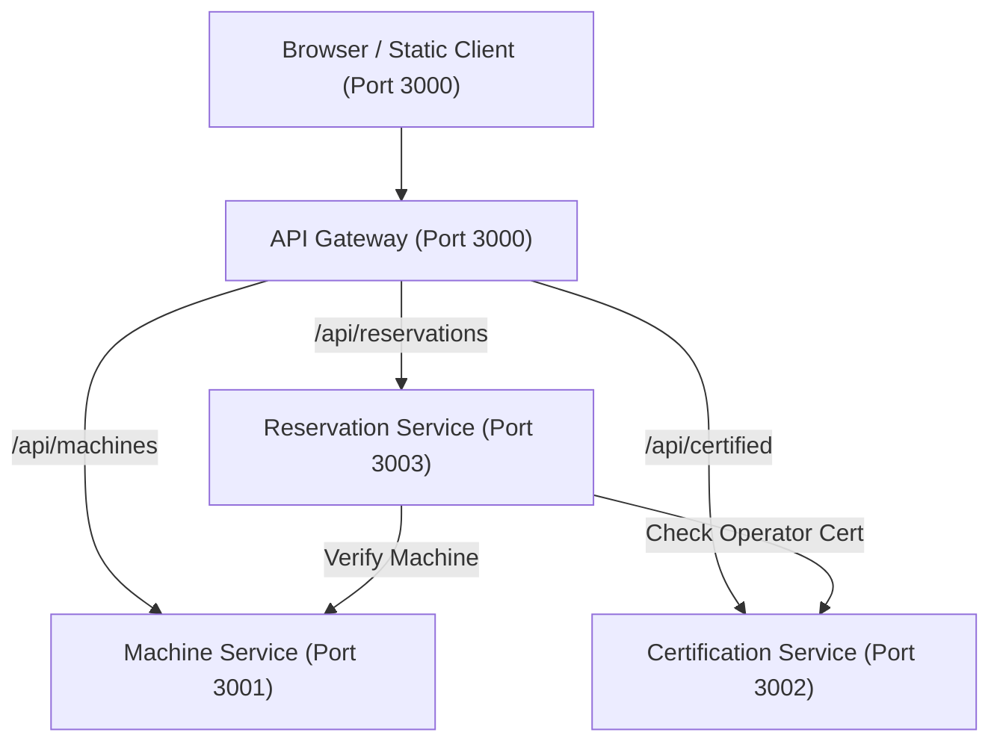

# Maker Space Booker

[](https://github.com/naveena-zen/makerspace-booker/actions/workflows/ci.yml)
[](https://github.com/naveena-zen/makerspace-booker/actions/workflows/cd.yml)
[](https://github.com/naveena-zen/makerspace-booker/actions/workflows/pages.yml)

A lightweight university makerspace equipment reservation system developed for the course **"Agile Project Development with Scrum"**. Users can safely reserve makerspace machinery (3D printers, laser cutters, workbenches) with strict automated operator safety-certification gating and collision prevention.

## Architecture



## How to Run

### Microservices via Docker Compose
```bash
docker compose up -d --build
```
Access the application at [http://localhost:3000](http://localhost:3000).

### Monolith (Legacy Mode)
```bash
cd monolith
npm install
npm test
npm start
```

### Microservices (Local Node.js)
Run each service independently:
```bash
# Terminal 1: Machine Service
cd services/machine-service && npm install && npm start

# Terminal 2: Certification Service
cd services/certification-service && npm install && npm start

# Terminal 3: Reservation Service
cd services/reservation-service && npm install && npm start

# Terminal 4: Gateway & Static Site
cd services/gateway && npm install && npm start
```
