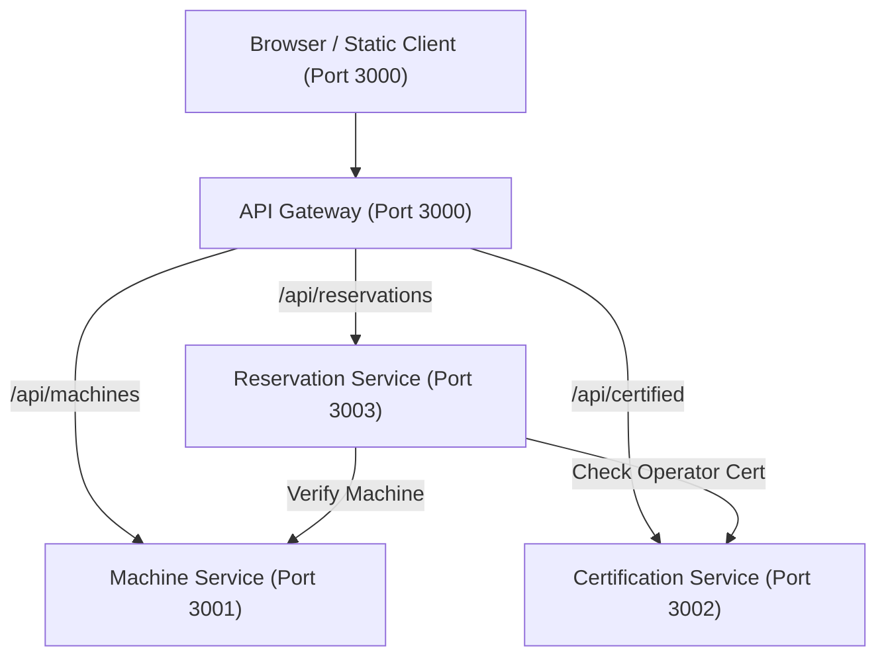

# MakerSpace Equipment Safety Booking System

[](https://github.com/naveena-zen/makerspace-booker/actions/workflows/ci.yml)
[](https://github.com/naveena-zen/makerspace-booker/actions/workflows/cd.yml)

A high-reliability university makerspace equipment booking platform built for the academic course **"Agile Project Development with Scrum"**. The system eliminates double-booking collisions and enforces operator safety-certification prerequisites across 3D printers, laser cutters, and open-access workbenches.

---

## Key Features

- **Automated Safety Certification Gating**: Restricts hazardous equipment (e.g., 3D Printer, Laser Cutter) exclusively to certified operators (`Ashley`). Uncertified users (`Justin`) are automatically barred with HTTP 403 Forbidden.
- **Collision & Double-Booking Prevention**: Atomically validates date and time-slot availability, rejecting conflicting reservations with HTTP 409 Conflict.
- **Strangler Fig Microservices Architecture**: Seamless migration path from an initial Express monolith to decoupled microservices coordinated via an API Gateway.
- **High-Velocity In-Memory Storage**: Zero external database dependencies; lightning-fast execution ideal for automated matrix CI pipelines.
- **Single-Page Web Application**: Interactive responsive frontend with live persona switching (`Ashley` / `Justin`), SVG hardware schematics, and WCAG AA high-contrast design.
- **End-to-End Health Monitoring**: Independent `/health` diagnostic endpoints across all services verified through automated Docker smoke tests.

---

## Tech Stack

| Domain | Technologies |
| :--- | :--- |
| **Backend Core** | Node.js 20 LTS, Express 4.19, Native Fetch API |
| **Frontend Client** | Semantic HTML5, Vanilla CSS3 (Design Tokens, WCAG AA), Modern ES6+ JavaScript |
| **Quality & Testing** | Jest 29, Supertest 6, ESLint 8 (`eslint:recommended`) |
| **Containerization** | Docker, Docker Buildx (multi-stage), Docker Compose v2 |
| **CI/CD Automation** | GitHub Actions (Matrix Pipeline, GHCR Docker Registry, GitHub Pages) |
| **Architectural Pattern**| Strangler Fig Decomposition, Reverse Proxy Gateway, Microservices |

---

## DevOps & Agile Workflow

This project adheres to rigorous Agile development and GitFlow release practices:

```
main ─────────────●───────────────────────────────────●────── (Production Deploy & CD)
                   \                                 /
develop ────────────●───────●─────────●─────────────●──────── (Sprint Integration)
                     \     /           \           /
feature/monolith ─────●───●             \         /
                                         \       /
feature/microservices ────────────────────●─────●
```

1. **GitFlow Branching Model**:
   - `main`: Production-ready release branch triggering CD deployment and GitHub Pages publishing.
   - `develop`: Primary sprint integration branch.
   - `feature/*`: Dedicated branches (`feature/monolith`, `feature/ci`, `feature/microservices`, `feature/website`).
   - `test/failing-check`: Short-lived branch with an intentional RED assertion followed by a GREEN fix commit to prove CI barrier integrity.
2. **Conventional Commits**: Every change is categorized (`feat:`, `fix:`, `ci:`, `test:`, `docs:`).
3. **CI Matrix Automation ([ci.yml](.github/workflows/ci.yml))**:
   - Triggers on pull requests and pushes to `develop` and `main`.
   - Runs parallel matrix jobs across `monolith`, `machine-service`, `certification-service`, `reservation-service`, and `gateway`.
   - Executes `npm ci`, ESLint linting, Jest test suites, and Docker image compilation on GitHub runners.
4. **Continuous Delivery ([cd.yml](.github/workflows/cd.yml))**:
   - Triggers on push to `main`.
   - Packages and publishes container images to GitHub Container Registry (GHCR) tagged with both Git SHA and `latest`.
   - Spins up `docker compose up -d` and executes automated HTTP 200 smoke tests on all `/health` endpoints.
5. **Static Hosting ([pages.yml](.github/workflows/pages.yml))**:
   - Automatically builds and deploys the gateway static website to GitHub Pages on release.

---

## Architecture



---

## How to Run

### 1. Microservices via Docker Compose (Recommended)
```bash
docker compose up -d --build
```
Access the application at [http://localhost:3000](http://localhost:3000).

### 2. Zero-Dependency Local Runner (Ultra-Lightweight)
Run the application locally without downloading heavy external dependencies or Docker:
```bash
node services/gateway/local-runner.js
```
Open [http://localhost:3000](http://localhost:3000) in your browser.

### 3. Monolith (Legacy Mode)
```bash
cd monolith
npm install
npm test
npm start
```

### 4. Microservices (Individual Local Node.js Processes)
```bash
# Terminal 1: Machine Catalog Service
cd services/machine-service && npm install && npm start

# Terminal 2: Safety Certification Service
cd services/certification-service && npm install && npm start

# Terminal 3: Core Reservation Service
cd services/reservation-service && npm install && npm start

# Terminal 4: API Gateway & Static Website
cd services/gateway && npm install && npm start
```

---

## Specifications & Requirements

For comprehensive user stories, seed dataset definitions, REST API contracts, and Scrum sprint backlog mapping, refer to [REQUIREMENTS.md](REQUIREMENTS.md).
